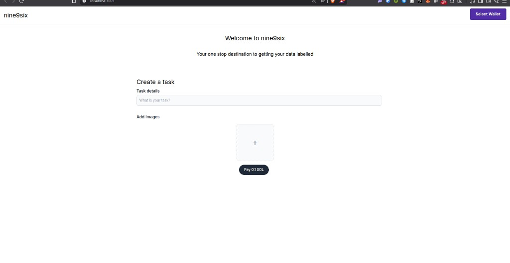
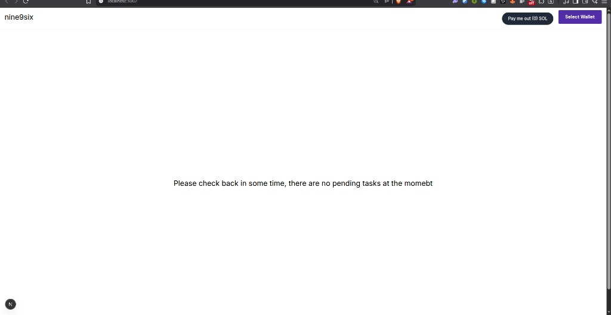

# nine9six

nine9six is a marketplace-style demo where **users** post micro-tasks (thumbnail-style image choices) and fund them on **Solana**, while **workers** complete tasks and receive payouts. The stack is a Node API backed by PostgreSQL, two Next.js apps (user and worker), wallet-based sign-in, AWS S3 for image uploads, and Solana for payments.

## UI preview (user app — create task)



The **Pay 0.1 SOL** control triggers a standard Solana transfer via the wallet adapter; after confirmation, the app submits the task to the API with that transaction signature. Uploaded images appear as thumbnails next to the add tile once S3 upload completes.

## UI preview (worker app — dashboard)



Workers connect a wallet, complete tasks when the queue has work, and use **Pay me out** to request a treasury transfer for accumulated earnings (see backend payout / OWS configuration). When nothing is available, the app shows the empty-state message.

## Repository layout

| Directory        | Role |
| ---------------- | ---- |
| `backend/`       | Express API (`/v1/user`, `/v1/worker`), Prisma, Solana RPC, S3 presigned uploads |
| `user-frontend/` | Next.js app for task creators |
| `worker-frontend/` | Next.js app for workers |

## Prerequisites

- Node.js 18+ (recommended)
- PostgreSQL database
- A Solana RPC endpoint URL (devnet or mainnet, depending on how you configure the app)
- AWS credentials and an S3 bucket in `us-east-1` (the API code uses a fixed bucket name `hkirat-cms`; change `backend/src/routers/user.ts` if you use your own bucket)
- For worker **payouts:** either configure **OWS** (`OWS_PLATFORM_WALLET_NAME`, `OWS_WALLET_PASSPHRASE`, and `PARENT_WALLET_ADDRESS` matching the OWS Solana account) or the legacy hot wallet in `backend/src/privateKey.ts` (base58 secret), funded on Solana.

## Backend environment variables

Copy the template and edit it (Prisma and the app load `backend/.env`):

```bash
cp backend/.env.example backend/.env
```

Set at least `DATABASE_URL` before running `npx prisma migrate deploy`. The file should contain:

| Variable        | Purpose |
| --------------- | ------- |
| `DATABASE_URL`  | PostgreSQL connection string for Prisma |
| `RPC_URL`       | Solana JSON-RPC URL |
| `ACCESS_KEY_ID` | AWS access key for S3 |
| `ACCESS_SECRET` | AWS secret key for S3 |
| `JWT_SECRET`    | Secret for user JWTs (defaults to a placeholder in code if unset; set this in production) |

Additional variables used by optional integrations are documented in [Integrations and environment reference](#integrations-and-environment-reference) below. Copy `backend/.env.example` for the full list.

## Backend setup and run

```bash
cd backend
npm install
npx prisma migrate deploy
npx prisma generate
npx tsc
node dist/index.js
```

The API listens on **port 3000** by default (`backend/src/index.ts`).

## Frontends

Both apps call the API via `BACKEND_URL` in `user-frontend/utils/index.ts` and `worker-frontend/utils/index.ts` (default `http://localhost:3000`). Change these if the API is hosted elsewhere.

**Port note:** Next.js defaults to port 3000, which conflicts with this backend. Run each app on a different port, for example:

```bash
cd user-frontend
npm install
npm run dev -- -p 3001
```

```bash
cd worker-frontend
npm install
npm run dev -- -p 3002
```

Then open `http://localhost:3001` and `http://localhost:3002` in the browser.

### Frontend troubleshooting (Solana wallet UI)

The wallet modal styles load from the **root** Next layout as ESM imports **after** `./globals.css` so Tailwind utilities still apply. Order in `app/layout.tsx`: `import "./globals.css"` first, then `import "@solana/wallet-adapter-react-ui/styles.css"`. Do not use `require()` for that CSS inside a client layout (it breaks with dev bundlers). Importing wallet CSS **before** globals can make the app look almost unstyled.

If you still see errors such as **“module factory is not available”** for `styles.css`:

1. Stop the dev server, delete `.next` in the affected app (`rm -rf user-frontend/.next`), and run `npm run dev` again.
2. Hard-reload the browser (or clear site data) so stale chunks or a **service worker** are not serving old bundles.
3. Confirm you are not proxying the dev server with aggressive `Cache-Control: immutable` on JavaScript or CSS.

## API overview

- **User routes** (`/v1/user`): sign-in (wallet message), presigned S3 upload, create tasks, fetch task details and submission aggregates, `POST /v1/user/task/:taskId/approve` (marks task done; optional `OWS_BACKEND_API_KEY` when set).
- **Worker routes** (`/v1/worker`): sign-in, fetch next task, submit an option choice, request payout.
- **Platform** (`/v1`): health, x402 deposit discovery, deposit instructions JSON, Allium status and optional query proxy (see [Platform and payment discovery endpoints](#platform-and-payment-discovery-endpoints)).

---

## Open Wallet Standard (OWS) — deep dive

[OWS](https://openwallet.sh) is a **local, policy-gated** wallet and signing stack: keys live in an encrypted vault (default `~/.ows`), and signing runs in-process via native bindings (`@open-wallet-standard/core`) or the **`ows`** CLI. It is **not** a hosted custodial API; your server or operator must have access to the vault passphrase when using server-side signing.

Official references:

- [OWS Quickstart](https://docs.openwallet.sh/doc.html?slug=quickstart)
- [Specification and docs index](https://github.com/open-wallet-standard/core) (storage format, signing interface, policy engine, agent access, supported chains)
- [Node.js SDK reference](https://github.com/open-wallet-standard/core/blob/main/docs/sdk-node.md) (`createWallet`, `signMessage`, `signAndSend`, policies, API keys for agents)

### What OWS gives you in nine9six

1. **Platform treasury on Solana** — Create a named wallet (e.g. `nine9six-platform`) with `ows wallet create --name nine9six-platform`. The SDK derives a **Solana** account among others. Fund that Solana address; it must match `PARENT_WALLET_ADDRESS` in the backend (or set `PARENT_WALLET_ADDRESS` to the address OWS shows for Solana).

2. **Worker payouts** — When `OWS_PLATFORM_WALLET_NAME` and `OWS_WALLET_PASSPHRASE` are set, `POST /v1/worker/payout` builds an unsigned Solana transfer from the treasury to the worker and calls OWS **`signAndSend`** so the vault key signs and broadcasts the transaction. If OWS env vars are **not** set, behavior falls back to the legacy **base58** hot key in `backend/src/privateKey.ts` (unchanged from the original app).

3. **Optional HTTP hardening** — `OWS_BACKEND_API_KEY` is an **application secret** you choose. When present, routes wrapped with `owsBackendApiKeyMiddleware` (currently task approval) require `X-OWS-API-Key: <secret>` or `Authorization: Bearer <secret>` **in addition to** the normal user JWT. This is **not** the same token as `ows key create` (those tie agent access to vault policies).

### OWS CLI vs Node SDK in this repository

- **CLI** (`npm install -g @open-wallet-standard/core` or the [install script](https://docs.openwallet.sh/install.sh)): best for **creating** wallets, **rotating** keys, **`ows key create`** with policies, and **`ows pay request` / `ows pay discover`** for x402 experimentation.
- **SDK** (`@open-wallet-standard/core` in `backend/package.json`): used in code only for **`signAndSend`** on the payout path when OWS env is configured. The server process must be able to read the vault (default path or `OWS_VAULT_PATH`).

### Policies and scoped agent keys (OWS native)

OWS can register **policies** (e.g. allowed chains, expiry) and issue **API keys** that reference wallet IDs and policy IDs (`createApiKey` in the Node SDK, or `ows policy create` / `ows key create` in the CLI). Those keys control **who may trigger signing** from tools that integrate with the vault. nine9six does **not** wire OWS agent tokens into HTTP automatically; the backend uses a separate **`OWS_BACKEND_API_KEY`** for Express middleware. For production, align your threat model: use OWS policies for any automation that signs, and use `OWS_BACKEND_API_KEY` (or mTLS, IP allowlists, etc.) for HTTP admin-style actions.

### Operational checklist (OWS payouts)

1. Install OWS CLI or ensure the same machine/user running the API can read the vault.
2. `ows wallet create --name nine9six-platform` (or import an existing mnemonic).
3. Note the **Solana** address; set `PARENT_WALLET_ADDRESS` and fund it on the network matching `RPC_URL`.
4. Set `OWS_PLATFORM_WALLET_NAME=nine9six-platform`, `OWS_WALLET_PASSPHRASE`, and `RPC_URL`.
5. Optionally set `OWS_VAULT_PATH` if the vault is not in the default location.
6. Leave `privateKey` empty or unset if you want **only** OWS to sign payouts; otherwise legacy key remains a fallback when OWS is not configured.

---

## HTTP 402 / x402 and task deposits

**Is there an x402 implementation?** **Partially.** The backend exposes **machine-readable payment discovery** for the same 0.1 SOL treasury deposit that task creation requires, but the **web UI does not run a full x402 paywall**. The browser flow remains: connect wallet → **Pay 0.1 SOL** (normal transfer) → submit task with signature. **Full x402** would typically mean the protected resource (e.g. `POST /v1/user/task`) returns **402** until a payment proof or header is supplied; this project keeps `POST /v1/user/task` as **200/4xx** with JSON and validates the existing Solana signature in the body instead.

**Task creation** still verifies an on-chain Solana transfer in `POST /v1/user/task` (amount and recipient checks against `PARENT_WALLET_ADDRESS`). That flow is unchanged so existing clients keep working.

**Discovery for x402-style / agent clients** (implemented in `backend/src/routers/platform.ts`):

| Method | Path | Behavior |
|--------|------|----------|
| GET | `/v1/x402/task-deposit` | Returns **HTTP 402** with a JSON body describing the Solana payment (`payTo`, `amountLamports`, etc.). |
| GET | `/v1/deposit-instructions` | Returns **HTTP 200** with the same payment parameters for clients that do not handle 402. |

Agents using the OWS CLI can experiment with **`ows pay request`** and **`ows pay discover`** against x402-enabled services (see the [core README](https://github.com/open-wallet-standard/core/blob/main/README.md) CLI table). Wiring a full automatic “pay then retry” loop for `POST /v1/user/task` is left to your client or gateway; this API exposes the **canonical payment requirements** so those tools know where and how much to pay.

---

## Allium

[Allium](https://docs.allium.so/api/overview) provides REST APIs for **realtime** blockchain data, **stream** transformations (often enterprise), and **Explorer**-style saved queries (often enterprise).

In nine9six:

- **`GET /v1/integrations/allium/status`** — Returns whether `ALLIUM_API_KEY` is set (no secret is echoed).
- **`POST /v1/integrations/allium/query`** — Forwards a JSON body to Allium using your API key. The default path is configurable via `ALLIUM_EXPLORER_QUERY_PATH`; you will typically set this to the URL path Allium gives you for a **saved Explorer query** once you have access.

Sign up for keys and product access at [app.allium.so](https://app.allium.so/join). Realtime endpoints are documented in their portal; Explorer API access may require an enterprise agreement per their docs.

---

## Platform and payment discovery endpoints

| Method | Path | Auth | Description |
|--------|------|------|-------------|
| GET | `/health` | None | Liveness JSON (`ok`, `service`). |
| GET | `/v1/x402/task-deposit` | None | HTTP **402** + x402-style JSON for task deposit. |
| GET | `/v1/deposit-instructions` | None | HTTP **200** with Solana `payTo` / lamports / human-readable note. |
| GET | `/v1/integrations/allium/status` | None | Whether Allium is configured. |
| POST | `/v1/integrations/allium/query` | None | Proxied Allium POST (requires `ALLIUM_API_KEY`). |

---

## Task approval and payouts (end-to-end)

1. **Creators** pay **0.1 SOL** (config: `TASK_DEPOSIT_LAMPORTS` in code) to the treasury when creating a task; the backend validates the transaction signature on `POST /v1/user/task`.
2. **Workers** complete tasks and accumulate **pending** balance; they call **`POST /v1/worker/payout`** to receive a transfer from the treasury.
3. **Creators** can mark a task closed with **`POST /v1/user/task/:taskId/approve`** (JWT required; if `OWS_BACKEND_API_KEY` is set, also send that key). This sets `done` on the task; it does not by itself batch-pay every worker (payouts remain explicit via `/payout`).

Treasury signing: **OWS** when env is set, else **legacy `privateKey`**.

---

## Integrations and environment reference

Core variables are listed earlier. Integration-specific variables (see `backend/.env.example`):

| Variable | Used by | Purpose |
|----------|---------|---------|
| `PARENT_WALLET_ADDRESS` | User task payment verification, worker payouts | Solana treasury pubkey; override for your deployment. |
| `OWS_PLATFORM_WALLET_NAME` | Payouts | OWS vault wallet name for `signAndSend`. |
| `OWS_WALLET_PASSPHRASE` | Payouts | Passphrase to decrypt signing material in the vault. |
| `OWS_VAULT_PATH` | Payouts | Non-default OWS vault root. |
| `OWS_BACKEND_API_KEY` | Task approve route | Optional second factor for HTTP (header or Bearer). |
| `ALLIUM_API_KEY` | Allium proxy | Bearer token for Allium API calls. |
| `ALLIUM_API_BASE_URL` | Allium proxy | API base (default `https://api.allium.so`). |
| `ALLIUM_EXPLORER_QUERY_PATH` | Allium proxy | Path for saved Explorer query execution. |

---

## Database

Schema and migrations live under `backend/prisma/`. Models include `User`, `Worker`, `Task`, `Option`, `Submission`, and `Payouts`.

## Security and production notes

- Replace default `JWT_SECRET` and never commit real secrets or private keys.
- Review hard-coded wallet addresses and S3 bucket names before deploying.
- CORS is enabled broadly in the API; tighten origins for production.

## License - MIT

See individual `package.json` files (for example `backend/package.json`) for declared package metadata; this repository may not include a top-level license file.


Copyright: HumbleFool07 2026